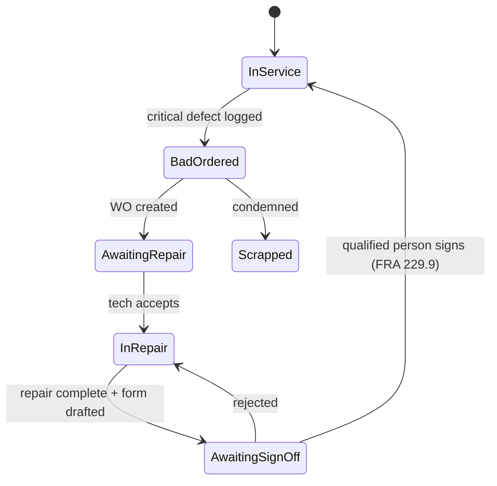

# Railio MVP Specification

> The AI co-pilot for rail maintenance. Voice-first. Manual-grounded. FRA-aware by default.

This spec is grounded in (a) the public thesis already on the [landing page](landing_page/index.html) and (b) a logged-in walkthrough of [app.oxmaint.ai](https://app.oxmaint.ai) — the closest competitor — to identify what is table-stakes and where the wedge is.

> **Read [MVP_v0.md](MVP_v0.md) first.** This document is the v1 plan — voice-first, mobile, offline-capture, multi-tenant, FRA-defensible. Before building any of it, we ship a deliberately tiny **v0 validation MVP**: a localhost web app, no auth, SQLite-only, dispatcher→tech handoff, four auto-filled forms, mock parts KB. v0 is a strict forward-compatible subset of v1 — same corpus pipeline, same citation discipline, same form schemas, same hash-log shape, same tool-use loop — so nothing built for v0 is thrown away. v1 (this document) only proceeds if v0 hits its success bar.

---

## 1. Product thesis

A **road car inspector** or **locomotive maintainer** stands next to a defective unit holding gloves and a flashlight. Today they radio the foreman, flip through a paper manual, run the repair, then spend 30–45 minutes back at the office filling out the FRA form by hand. Most of that admin time is recovered by **talking to Railio**: it listens, looks up the manual, walks them through the repair, and pre-fills the FRA paperwork from what actually happened. The technician proofreads and signs. The form is preserved with a tamper-evident hash chain so audits become a non-event.

**One sentence positioning:** Railio replaces the radio, the manual, and the clipboard with one voice-driven workflow that produces FRA-defensible documentation as a side effect of doing the job.

---

## 2. User personas

| Persona | Where they work | Top jobs-to-be-done | Today | With Railio |
| --- | --- | --- | --- | --- |
| **Road Car Inspector** | Yard, trackside, on-car | Daily train inspection (49 CFR 215), defect tagging, air brake test (49 CFR 232) | Paper Form FRA F6180.49A; radio dispatch; manual flips | Voice-driven walkaround; defect cards auto-filled; air brake test guided |
| **Locomotive Maintainer** | Shop, on-locomotive | Daily inspection (49 CFR 229.21), 92-day/annual/biennial inspections, repair execution | Reads OEM manual on a laminated page; writes longhand | Asks for the procedure, gets cited steps; logs each step by voice |
| **Maintenance Manager** | Office, occasional yard | Triage backlog, assign work, sign off bad-orders, pull reports | Spreadsheets + CMMS clicks | Web review queue; one-click sign-off; audit export |
| **Safety / Compliance Officer** | Office, audit visits | Prove FRA compliance, track findings, retain records 6 yrs | Three-ring binders + CMMS exports | Filterable audit log; one-click FRA-defensible PDF + JSON bundle per unit |

**MVP focus:** the first two personas are the wedge. If techs don't use it in the yard, nothing else matters.

---

## 3. Scope: phasing and in / out of v1

### Phasing

| Phase | What | Source of truth |
| --- | --- | --- |
| **v0 — validation** | Localhost web app, **no auth** (role cookie: Dispatcher / Tech), **SQLite** for everything (data + vectors via sqlite-vec), single locomotive family (GE Evolution ES44AC/ET44AC), two-stage chat with **dispatcher → tech handoff**, mock parts KB (~30 realistic GE parts), and **four forms** auto-filled from the conversation in a separate `/forms` tab: F6180.49A, Defect Card / Bad-Order Tag, Daily Inspection (229.21), Parts Requisition. ~5.5 weeks. | [MVP_v0.md](MVP_v0.md) |
| **v1 — this document** | Voice-first mobile (RN+Expo) + thin web admin, multi-asset rail-typed model, multi-tenant corpus, RBAC + "qualified person" gating, real audit hash chain, offline capture + online AI. | This file (MVP.md) |
| **v1.x** | Wake word, AAR/OEM licensed corpus, F6180.50, Inspection Routes, RCA, BLE tools, IoT read | TBD |
| **v2** | Predictive analytics, on-prem, TMS/EAM integrations | TBD |

v0 → v1 is forward-compatible by construction: same corpus pipeline, same citation discipline, same form schema, same hash-log shape. No data migration required, only feature additions.

### In / out of v1

| In MVP (v1) | Out of MVP (defer) |
| --- | --- |
| Voice-driven defect intake | Predictive failure analytics |
| Manual-grounded RAG with citations | IoT/sensor ingestion (read-only later) |
| FRA Form F6180.49A draft + sign-off | Form F6180.78, F6180.81, etc. |
| Daily locomotive inspection workflow (229.21) | Track-side track-defect workflow |
| Air brake test workflow (232.205, 232.207) | Crew/HOS management |
| Bad-order / out-of-service tagging | Vendor / purchase orders |
| Tamper-evident audit log + export | Inventory & parts (read-only later) |
| Mobile field app (iOS + Android) | Native dispatch / TMS integration |
| Thin web admin (review, audit, RBAC) | Full web parity for techs |
| Offline capture with sync | On-prem deployment (cloud-first) |
| Manual / OEM doc ingestion (per tenant) | Generic chat-with-docs UI |

---

## 4. Core workflows

### 4.1 Voice-driven defect intake → repair → FRA form

```mermaid
sequenceDiagram
    actor Tech
    participant App as Railio Mobile
    participant AI as Synapse-killer (Claude + RAG)
    participant FRA as FRA Form Engine
    participant Mgr as Manager (web)

    Tech->>App: "Unit 4423, brake pipe pressure low at car 6"
    App->>AI: transcript + asset context
    AI->>AI: retrieve from manual (cited)
    AI->>App: probable causes + repair steps + safety notes
    App->>Tech: voice + screen: "Step 1 of 6 — close angle cock at..."
    Tech->>App: "Done." / "Skip." / "Photo." (per step)
    App->>FRA: stream step events + media + GPS + timestamps
    FRA->>FRA: populate 49A line items as steps complete
    FRA->>App: draft form ready for review
    Tech->>App: review + voice sign-off ("I, Imran Husain, certify...")
    App->>Mgr: queued for manager review (if policy requires)
    Mgr->>App: countersign / reject
    App->>App: hash-chain commit; PDF + JSON archived
```

**Critical primitives:** push-to-talk + wake-word, streaming transcription, per-step state machine, voice sign-off captured as audio + transcript + crypto-signed event.

### 4.2 Daily inspection (49 CFR 229.21)

Checklist-driven walkaround of the locomotive. Each item is a Pass/Fail/Not-Applicable with optional photo, comment, GPS. Exception items auto-create a defect card. Completion writes an inspection record signed by the inspector; if any item is "fail" + critical, the unit is auto-tagged **bad-order** until cleared.

Mirrors Oxmaint's checklist engine (Pass/Fail · Selection · Text · Numeric · Range · Photo · Signature, with toggles for photo/comment/audio/video/GPS) — so we can reuse the data shape and just change defaults: **audio always on, voice navigation always available**.

### 4.3 Air brake test (49 CFR 232.205 Class I / 232.207 Class IA)

Guided test. Railio reads the procedure from the manual, prompts each setpoint, captures the gauge reading by photo+OCR or voice, and times each leak-down phase using the device clock. The result populates the air brake portion of F6180.49A automatically.

### 4.4 Bad-order / out-of-service lifecycle



Sign-off requires the user role be flagged as "qualified" (49 CFR 229.7). Releasing to service without that role is blocked at the API.

---

## 5. Data model

```
Org ──< Site ──< Asset (locomotive | car | component) ──< Asset (sub-component, recursive)
                          │
                          ├──< WorkOrder ──< WorkOrderTask
                          ├──< InspectionRecord ──< InspectionItemResult
                          ├──< DefectCard
                          ├──< AirBrakeTest
                          └──< FRAForm (F6180.49A, ...)

User ──< Role ──< Permission
User ──── signs ─── (anything signable)
AuditEvent (append-only, hash-chained over the whole tenant)
ManualChunk (per-tenant vector + page citation)
```

### Key entities (MVP fields only)

- **Asset** — id, parent_id, type (`locomotive | car | truck | wheelset | brake_system | component`), reporting_mark, road_number, model, manufacturer, serial, in_service_date, last_inspection_at, status (`in_service | bad_ordered | in_repair | out_of_service | scrapped`), qr_code, location_lat_lng. *(Mirrors Oxmaint's parent_asset hierarchy + QR/Barcode + dates; adds rail-specific type enum and reporting_mark/road_number.)*
- **DefectCard** — id, asset_id, opened_by, opened_at, fra_part (e.g. `229.45`), description, severity (`minor | major | critical`), media[], gps, voice_transcript, status, linked_work_order_id.
- **WorkOrder** — id, title, asset_id, priority, status, assigned_to, opened_at, closed_at, tasks[], parts_used[], voice_log[].
- **InspectionRecord** — id, asset_id, template_id, inspector_id, started_at, completed_at, items[], signed_at, signature_audio_url. Items mirror Oxmaint's structure: `pass | fail | na | text | numeric | range | photo | signature`.
- **AirBrakeTest** — id, asset_id, test_type, performed_by, readings (json), pass, started_at, completed_at, linked_form_id.
- **FRAForm** — id, asset_id, form_type (`F6180.49A`), version, fields (json), source_events[] (FK → AuditEvent), pdf_url, status (`draft | signed | filed`), signers[].
- **AuditEvent** — id, tenant_id, ts, actor_id, action, target_kind, target_id, payload, prev_hash, hash. Append-only. Hash chain verifiable end-to-end.
- **ManualChunk** — id, tenant_id, source_doc_id, page, text, embedding. Cited on every AI answer.

---

## 6. FRA compliance layer (the moat)

This is what separates Railio from any generic CMMS — including Oxmaint, which has a Work Permits module under "EHS" but no regulator-specific form support.

### Forms supported in v1
- **FRA Form F6180.49A** — Locomotive Inspection and Repair Record (the daily/periodic gateway form).

### Forms supported v1.1
- **FRA Form F6180.50** — Locomotive defect report (when bad-ordered + filed).

### Field-level source mapping (excerpt)

Every required field on F6180.49A must be backed by a captured event with provenance, not by free-text guess.

| F6180.49A field | Source |
| --- | --- |
| Reporting mark + road number | Asset (manually set or QR/OCR scan) |
| Date of inspection | InspectionRecord.completed_at |
| Class of inspection | Inspection template |
| Inspector name + title | User profile (must hold "qualified" role per 229.7) |
| Defects observed | DefectCards opened during inspection |
| Repairs performed | WorkOrder.tasks where outcome = done |
| Air brake test result | AirBrakeTest.pass + readings |
| Out-of-service date | Asset status transition timestamp |
| Signature | Voice + cryptographic signature event |

### Tamper-evident audit log

- Every write produces an **AuditEvent** with `prev_hash → hash` (SHA-256). Tenant chain is verifiable from genesis.
- Signature events bind: actor_id + form_version_hash + audio_hash + timestamp. Signed with a per-tenant Ed25519 key held in a KMS.
- Export bundle = signed PDF + JSON of source events + chain-of-custody proof. This is the artifact handed to an FRA inspector.
- Retention: 6 years minimum (FRA req for inspection records; longer for some categories).

### Manual-grounded RAG

- Per-tenant vector store. Sources: customer OEM manuals, AAR field manuals (where licensed), customer historical work orders, customer SOPs.
- **Refuse by default outside the corpus.** If retrieval confidence is low, the answer is "I don't have that in your manuals — open a ticket with Engineering."
- Every answer cites: doc title + page + section. Tap the citation → opens the source PDF at that page.
- Oxmaint's Synapse AI cites "industry best practices" with no source-of-truth — that is precisely the failure mode Railio refuses to ship.

---

## 7. Mobile-first architecture

### Form factor decision
- **iOS + Android, single codebase.** Recommend **React Native + Expo** for v1: faster cross-platform delivery, native modules where needed (audio, camera, BLE), one team. Re-evaluate native at v2 if RN voice latency is a bottleneck.
- **Thin web admin** (Next.js + same TypeScript types) for managers + safety officers. No field functionality on web.

### Critical mobile capabilities

| Capability | Why | Notes |
| --- | --- | --- |
| **Push-to-talk + wake word** ("Hey Railio") | Gloves; both hands on equipment | On-device VAD; backend Whisper / Deepgram for accuracy |
| **Streaming TTS** | Repair walkthroughs feel like a foreman, not a chatbot | ElevenLabs or OpenAI TTS; cache common prompts |
| **Camera + OCR** | Read reporting marks, gauge readings, tag plates | On-device OCR for unit numbers; cloud OCR for forms |
| **QR/Barcode scan** | Asset lookup is one tap | Reuse Oxmaint's QR pattern — every asset gets a printable QR |
| **Offline capture, online AI** | Yards have no signal; LLMs can't run on-device at usable quality | Capture (audio recordings, photos, checklist responses, defect cards, repair steps) is local-first via SQLite + op-log. AI calls queue and replay when connectivity returns. Tech sees "queued — will respond when back online" instead of an error. The walkthrough loop degrades gracefully: if you're offline, you get a recorder and the manual, not an AI co-pilot |
| **GPS + timestamps** | Audit provenance | Bind to every signed event |
| **BLE pairing** | Future: gauge tools, torque wrenches | v1: stub the abstraction; ship in v1.x |
| **Glove-friendly hit targets** | Industrial use | Min 56 px tap targets; high-contrast theme; daylight-readable |

### State management
- Append-only event log on device → sync to server → server applies to projection tables. CRDT-ish for the entities that matter (defects, audit events). Strong consistency only at sign-off (server is authoritative for "qualified" check).

### Connectivity model
- **Optimistic local commit** for inspection items, defect cards, repair steps, photos, audio.
- **AI is online-only** — when offline, the assistant becomes a recorder. The tech can dictate notes and continue the inspection; AI responses, manual lookups, and form drafts queue and execute on reconnect. We will not pretend an on-device model can give a tech rail-safety advice in v1.
- **Block sign-off** until server reachable + qualified-role check passes (cannot release a unit to service offline).
- **Local cache of last-used manual sections** per asset, so a tech who looked something up on the way to the yard still has reading material if signal drops mid-job. Not the same as "offline AI" — just paged docs.

---

## 8. AI architecture

### Models
- **Anthropic Claude Sonnet** — default for repair walkthroughs, fault triage, form-field draft.
- **Anthropic Claude Opus** — escalate-on-low-confidence path for hard diagnoses or safety-critical clarifications.
- **Prompt caching** on the manual corpus + safety appendices. Most calls hit cache; per-call cost dominated by tech speech transcript + retrieval chunks.

### Retrieval
- Per-tenant vector index (e.g. pgvector or Turbopuffer) over OEM manuals, AAR rule books, customer SOPs, prior work orders for the same asset class.
- Reranker on top retrievals (cross-encoder, e.g. Cohere rerank).
- **Refuse-by-default** when top-k similarity below threshold.

### Tool use
The model exercises tools rather than free-form output:
- `lookup_asset(reporting_mark, road_number) → Asset`
- `open_defect_card(asset_id, fra_part, description, severity) → DefectCard`
- `update_form_field(form_id, field, value, source_event_id) → ()`
- `request_signoff(form_id, role_required) → SignOffRequest`
- `cite(chunk_id) → Citation` — every model output has at least one.

### Guardrails
- No model-issued "release to service." That is always a human sign-off action with a qualified-role check at the API boundary.
- Confidence threshold for repair steps: below threshold → suggest, never instruct, and surface the source manual page.
- Voice transcripts of every interaction kept verbatim in the audit chain.

---

## 9. Roles & permissions (RBAC matrix, MVP)

Adapted from Oxmaint's role list (Business Owner, Office Admin, Safety Manager, Maintenance Manager, Service Engineer, Technician, Executive) and narrowed/renamed for rail context.

| Role | Inspect | Open defect | Execute repair | Draft form | Sign form | Release-to-service | Manage users | Audit export |
| --- | --- | --- | --- | --- | --- | --- | --- | --- |
| Technician (qualified) | ✅ | ✅ | ✅ | ✅ | ✅ | ✅ | ❌ | ❌ |
| Technician (apprentice) | ✅ | ✅ | ✅ | ✅ | ❌ | ❌ | ❌ | ❌ |
| Maintenance Manager | ✅ | ✅ | ❌ | ✅ | ✅ (counter) | ✅ | ✅ (within site) | ✅ (own site) |
| Safety / Compliance Officer | view | view | view | view | ❌ | ❌ | ❌ | ✅ (org-wide) |
| Org Admin | view | view | ❌ | ❌ | ❌ | ❌ | ✅ | ✅ |

"Qualified" is a per-user flag, not a role — gates 49 CFR 229.7 / 229.9 actions.

---

## 10. Non-functional requirements

| Area | Target |
| --- | --- |
| Compliance | SOC 2 Type II (target by month 12); FRA record retention ≥ 6 yrs |
| Tenant isolation | Per-tenant DB schemas + per-tenant KMS keys; no cross-tenant model training, ever |
| Data residency | US (default), EU, on-prem (post-MVP) |
| Availability | 99.9% web/admin; mobile must function fully offline (no SLA dependency for field work) |
| Latency | Voice → first audio response < 1.5 s p95 over LTE; < 600 ms on Wi-Fi |
| Audit verifiability | Hash chain externally verifiable from a published genesis hash |
| Accessibility | Daylight-readable contrast, ≥ 56 px hit targets, voice-only flow possible end-to-end |

---

## 11. MVP success metrics

Tied to the [landing page's projected impact](landing_page/index.html), with measurement defined.

| Public claim | v1 measurement |
| --- | --- |
| Documentation time −93% | Median time from "repair complete" → "form signed", per tech, vs. baseline survey at pilot start |
| MTTR −38% | Median time from defect open → in-service, by asset class |
| Compliance findings = 0 | Count of FRA findings per audit cycle, vs. trailing year |
| Annual labor recovered $2.4M / 100 techs | Hours-per-week-on-admin survey × loaded labor cost |
| Fleet availability +4.2 pts | Sum of in-service hours / total hours, by fleet |

Pilot success bar: **3 short-line or regional operators**, **≥ 60% of inspections completed in-app**, **≥ 90% of forms signed without correction by manager**, **0 FRA findings tied to documentation**, **NPS ≥ 40 from techs**.

---

## 12. Open questions / decisions needed

1. **RN vs. native** — assumed RN; revisit if voice round-trip latency exceeds budget on Android mid-tier devices.
2. **First TMS/EAM integration** — Trapeze, Rail Solutions, or homegrown? Decide based on first-pilot operator's stack.
3. **Pilot ICP** — short-line (faster sales, smaller ARR) vs. Class I (long sales, reference logo). Recommendation: open with 2 short-lines + 1 regional, queue Class I conversations for v1.x.
4. **Manual licensing** — AAR field manuals and OEM manuals have varying terms. Customer-uploaded only in v1; licensed corpus in v1.x.
5. **Wake word** — "Hey Railio" vs. push-to-talk only. Recommendation: ship PTT first; wake word in v1.x once we have field audio data to tune false-trigger rates.
6. **On-prem** — punted to v2; pilot operators contractable on cloud (US data residency) for now?

---

## 13. Appendix: Oxmaint deltas (what we observed)

What Oxmaint **does well** (copy these primitives):

- **Asset hierarchy via parent_asset.** Plus QR + Barcode + SAP Equipment Number fields native — re-use this exact shape, add rail-specific type enum.
- **Inspection checklist primitives.** Item types (Pass/Fail · Selection · Text · Numeric · Range · Photo · Signature) with per-item toggles for Required / Critical / Photo / Comment / Audio / Video / GPS. Shape is right; defaults are wrong. Railio: audio on, voice nav on.
- **Work order multi-step form** with required (Basic / Tasks / Review) and optional (Safety, Parts, Attachments, Labor, Remarks, Costs) sections — sensible split, but the form is the wrong front door for techs in the field. Voice is.
- **QR-code-driven asset lookup** ("Scan QR" in the global header). Every asset gets a QR. Adopt verbatim.
- **"Bad-order"-adjacent statuses** ("Critical Path" tile on Asset Master) — they have the concept, just not the regulatory wiring.
- **Inspection Routes** (`/en/logbook-routes`) — area-based inspection rounds. Maps cleanly to a yard walkaround / consist inspection. Adopt the model.
- **Root Cause Analysis** module (`/en/inspection/rca`) — useful for repeated defects; defer to v1.x but worth the placeholder.

What Oxmaint **lacks** (Railio's wedge):

| Gap | Railio's answer |
| --- | --- |
| **No voice-first capture.** Mobile is desktop UI shrunk into a phone viewport. Tested at 390 × 844 — multi-step form, no mic, no offline. | Voice-first by design; PTT + wake word; full flow possible without typing |
| **AI is bolt-on, not workflow-embedded.** "Synapse AI" is a side panel + "Ask Synapse" button + a separate "Documents AI" page that you must visit to chat with PDFs. The work-order create form has an "AI Generate" button that auto-fills from "industry best practices" — generic, no citations | AI is the workflow. Every screen is "what would you say next" + cited retrieval |
| **No regulator-aware forms.** Work Permits exists under EHS, but no FRA / DOT / OSHA-specific form generators tied to event capture | F6180.49A as a first-class entity, populated by source events with provenance |
| **No tamper-evident audit log surfaced.** No external verifiability story | SHA-256 hash chain, exportable, externally verifiable |
| **Manual grounding implied but not delivered.** Synapse AI claims "compliance and safety guidance" but cites no source. Tech can't tell whether advice came from their manual or LLM training data | Refuse-by-default outside manual corpus; every answer cites doc + page |
| **Generic CMMS asset model.** Asset has Manufacturer/Model/Serial but nothing rail-specific (reporting mark, road number, AAR mechanical designation) | Rail-typed asset model with reporting_mark, road_number, MDC code |
| **No "qualified person" gating.** Anyone with the right RBAC bit can "complete" anything. FRA 229.7 / 229.9 require qualified persons for sign-off | Per-user "qualified" flag, gated at API; releases-to-service blocked otherwise |
| **No offline mode** | Local-first event log, sync-on-reconnect |

---

## File map of this work

- [MVP_v0.md](MVP_v0.md) — **read first**. The 5.5-week web validation build. v1 only proceeds if v0 hits its success bar.
- [MVP.md](MVP.md) — this document. The v1 plan.
- [landing_page/index.html](landing_page/index.html) — public thesis. v1 must remain consistent with every public claim there.
- `.playwright-mcp/` — raw Oxmaint walkthrough captures and screenshots used to derive §13. Not committed; reproducible via the Playwright MCP session.
