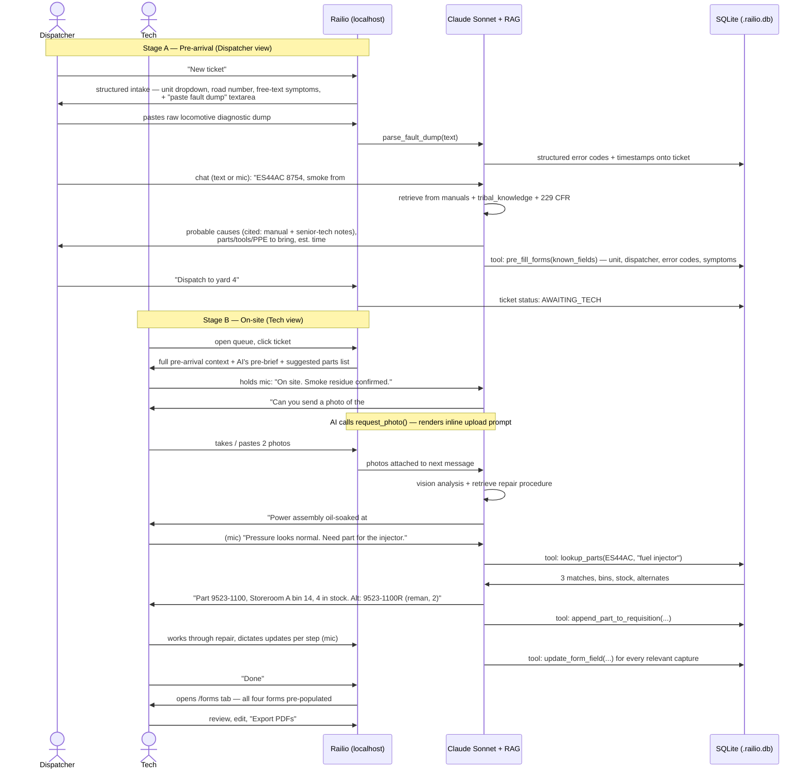

# Railio v0 — Local Validation MVP

> Goal: prove the loop end-to-end on a laptop, with no auth, no cloud, no mobile. A dispatcher opens a fault ticket, a tech picks it up on arrival, talks to Railio, gets parts guidance, repairs the unit, and the four FRA / shop forms fall out auto-filled in a separate tab.

This is the build that comes **before** [MVP.md](MVP.md). It runs on `localhost` against a single SQLite file. One locomotive family. One yard's worth of mock parts. No accounts, no users table — just a role toggle on entry. Designed to be runnable and demoable to a real rail tech on a single laptop in five-ish weeks.

> **For parallel implementation, this spec is split into two build files (each self-contained with the shared API + type contract):**
> - **[backend/MVP_v0_BACKEND.md](backend/MVP_v0_BACKEND.md)** — Next.js API routes (port `:3001`), SQLite schema, AI tool execution, corpus retrieval, PDF rendering.
> - **[frontend/MVP_v0_FRONTEND.md](frontend/MVP_v0_FRONTEND.md)** — Pages (port `:3000`), chat UI, mic input, image input, forms tab, citations rendering. Calls the backend via CORS.
>
> Repo layout: `backend/` and `frontend/` are **two separate Next.js apps** sharing one source of truth at [contract/contract.ts](contract/README.md). Both spec files duplicate the same §4 contract so neither chat needs to read the other. If either side changes a type or endpoint, update `contract/contract.ts` + both spec files.

---

## 1. Hypothesis

> Given (a) a structured fault intake from dispatch, (b) a chat with manual-grounded answers, and (c) a realistic parts knowledge base, a rail tech will diagnose + repair a GE Evolution Series locomotive faster than today, and the four required forms will populate from that conversation accurately enough that a manager would countersign with minor edits.

We are validating, in priority order — diagnosis first, paperwork last:
1. **Diagnosis trust** — does the tech believe the AI's answer because of cited manual pages **and** cited senior-tech (tribal) notes?
2. **Parts found** — does the AI consistently turn "I need a thing for the injector" into "Part 9523-1100, Storeroom A bin 14, 4 in stock"?
3. **Pre-arrival value** — does the dispatcher → tech handoff (with parsed fault dump + AI pre-brief) actually save the tech time vs. radio-and-paper?
4. **Form quality** — do the four forms come out correct enough that the manager would countersign with minor edits?

If 1 or 2 fails, the wedge isn't there — fix that before [MVP.md](MVP.md). Forms are the proof, not the sale.

---

## 2. Scope

| In v0 | Out of v0 (deferred to [MVP.md](MVP.md)) |
| --- | --- |
| **Localhost web app** (Next.js + SQLite file on disk) | Cloud deploy, mobile, offline sync |
| **No auth.** Role picker on entry: `Dispatcher` or `Tech` | Login, RBAC, "qualified person" gating |
| **One locomotive family**: GE Evolution — ES44AC and ET44AC | Other unit types, hierarchy, multi-tenant |
| **Two-stage chat** with handoff: Dispatcher (pre-arrival intake) → Tech (on-site repair) — same thread | Full voice-first UX (streaming TTS, wake word) |
| **Paste-the-fault-dump** field in dispatcher intake: tech or dispatcher pastes the locomotive's raw diagnostic output (GE ToolBoxLOCO export, fault history screen). AI parses → structured error codes + timestamps | Direct integration with locomotive diagnostic systems |
| **Four forms auto-filled from the chat**, all visible in a separate `/forms` tab: F6180.49A, Defect Card / Bad-Order Tag, Daily Locomotive Inspection (229.21), Parts Requisition | Other FRA forms; manager review queue |
| **Realistic mock Parts KB** in SQLite (~30 parts, compatible_units, bin location, qty, supplier, lead time, alternates, last_used_at) | Real inventory integration |
| **Two corpus doc classes**, both cited inline: `manual` (GE Evolution operator + maintenance, 49 CFR 229 + 232, AAR excerpts) and `tribal_knowledge` (senior-tech notes seeded by the rail SME during pilot setup — informal heuristics, "always check X before Y") | Per-tenant corpus upload UI; licensed AAR/OEM corpus |
| **Mic input** on every chat box via the browser's Web Speech API — press-and-hold to dictate, no streaming TTS back | Streaming TTS, wake word, foreman-quality voice UX |
| **Image-as-first-class chat input.** Drag, paste, or upload. Sent to the multimodal model. **AI proactively requests photos when ambiguous** ("Can you send a photo of the #3 power assembly oil pan?") via a `request_photo` tool that renders a one-tap upload prompt | Camera capture / OCR / QR scan |
| **PDF export** of any form (browser print or `@react-pdf/renderer`) | E-signature flow, tamper chain |
| **Append-only events table** with `prev_hash` for forward-compatibility with v1 | KMS-signed audit chain |

---

## 3. The two-actor flow



Two views, one DB, one chat thread per ticket. **No login** — the entry screen has a "I am a Dispatcher / I am a Tech" toggle that sets a `role` cookie and routes accordingly.

---

## 4. Surface area

### 4.1 Routes

| Route | Who | What |
| --- | --- | --- |
| `/` | anyone | Role picker (Dispatcher / Tech). Sets cookie, routes to `/dispatcher` or `/tech`. |
| `/dispatcher` | Dispatcher | List of all tickets + "New ticket" button. |
| `/dispatcher/new` | Dispatcher | Structured intake: unit dropdown, road number, free-text symptoms, **paste-fault-dump textarea** (raw locomotive diagnostic output → AI parses), photo upload, plus chat panel with mic-enabled input. On submit → ticket created with status `AWAITING_TECH`. |
| `/tech` | Tech | Queue of `AWAITING_TECH` and `IN_PROGRESS` tickets. |
| `/tech/ticket/:id` | Tech | Two-pane: chat (left, with mic + drag/paste/upload for images) + live "Repair context" (right) showing unit info, parsed fault codes, suggested parts, cited corpus chunks (manual + tribal — visually distinguished), photo timeline. AI may render an inline `request_photo` prompt at any point. |
| `/tech/ticket/:id/forms` | Tech | The four forms in tabs. Each form is editable and exportable to PDF. |
| `/admin/parts` | anyone | (Dev tool) Browse/edit the mock parts KB. Exists so the rail SME can correct mock data during the pilot. |

That's it. No settings page, no profile, no history beyond the ticket queue.

### 4.2 Stack

- **Next.js 15** (App Router). One process serves UI + API routes.
- **SQLite** via `better-sqlite3`. File path: `./.railio.db`. Auto-created on first run.
- **Drizzle ORM** for the schema (typed migrations, easy to read).
- **`sqlite-vec`** extension for vector search over both corpus doc classes. Same file.
- **Anthropic SDK** — `claude-sonnet-4-6` (multimodal — accepts image inputs in chat). Prompt caching on the system prompt + corpus index.
- **Web Speech API** for mic input. No external transcription service in v0; the browser does it. Press-and-hold mic button on every chat box; transcript appears in the textarea before send so the tech can correct it.
- **PDF**: `@react-pdf/renderer` for typed form templates.
- **Photos**: stored as files under `./.railio-uploads/`, path referenced from DB. Sent inline to the model on the next chat turn.
- **No auth library.** No NextAuth, no Clerk. Cookie says `role=dispatcher` or `role=tech`. That's the entire authz.

```bash
npm install
npm run db:migrate     # creates .railio.db, runs Drizzle migrations
npm run db:seed        # loads the parts KB + manual corpus + sample tickets
npm run dev            # localhost:3000
```

### 4.3 SQLite schema (the whole thing)

```sql
-- Assets: only the unit instances we'll demo with
CREATE TABLE assets (
  id INTEGER PRIMARY KEY,
  reporting_mark TEXT NOT NULL,        -- 'BNSF'
  road_number TEXT NOT NULL,           -- '8754'
  unit_model TEXT NOT NULL,            -- 'ES44AC' | 'ET44AC'
  in_service_date TEXT,
  last_inspection_at TEXT
);

-- Tickets: a single fault from open to close
CREATE TABLE tickets (
  id INTEGER PRIMARY KEY,
  asset_id INTEGER REFERENCES assets(id),
  status TEXT NOT NULL,                -- 'AWAITING_TECH' | 'IN_PROGRESS' | 'AWAITING_REVIEW' | 'CLOSED'
  opened_by_role TEXT NOT NULL,        -- 'dispatcher'
  opened_at TEXT NOT NULL,
  initial_error_codes TEXT,            -- comma list, e.g. 'EOA-3, FUEL-PRESS-LOW'
  initial_symptoms TEXT,
  fault_dump_raw TEXT,                 -- raw paste from locomotive diagnostic screen
  fault_dump_parsed TEXT,              -- JSON: AI-parsed {code, ts, severity}[] from fault_dump_raw
  pre_arrival_summary TEXT,            -- AI-generated brief for the tech
  closed_at TEXT
);

-- Chat messages, append-only, hash-chained
CREATE TABLE messages (
  id INTEGER PRIMARY KEY,
  ticket_id INTEGER REFERENCES tickets(id),
  role TEXT NOT NULL,                  -- 'dispatcher' | 'tech' | 'assistant' | 'system' | 'tool'
  content TEXT NOT NULL,               -- markdown
  citations TEXT,                      -- JSON: [{doc_id, page, chunk_id}]
  attachments TEXT,                    -- JSON: file paths
  created_at TEXT NOT NULL,
  prev_hash TEXT,
  hash TEXT NOT NULL                   -- sha256(prev_hash || row payload)
);

-- Parts knowledge base
CREATE TABLE parts (
  id INTEGER PRIMARY KEY,
  part_number TEXT NOT NULL UNIQUE,
  name TEXT NOT NULL,
  description TEXT,
  compatible_units TEXT NOT NULL,      -- JSON array: ['ES44AC','ET44AC']
  bin_location TEXT NOT NULL,          -- 'Storeroom A / Bin 14'
  qty_on_hand INTEGER NOT NULL,
  supplier TEXT,
  lead_time_days INTEGER,
  alternate_part_numbers TEXT,         -- JSON array
  last_used_at TEXT
);

-- Live link of parts to a ticket's pull slip
CREATE TABLE ticket_parts (
  id INTEGER PRIMARY KEY,
  ticket_id INTEGER REFERENCES tickets(id),
  part_id INTEGER REFERENCES parts(id),
  qty INTEGER NOT NULL,
  added_via TEXT NOT NULL,             -- 'ai_suggestion' | 'tech_manual'
  added_at TEXT NOT NULL
);

-- Forms — one row per (ticket × form_type)
CREATE TABLE forms (
  id INTEGER PRIMARY KEY,
  ticket_id INTEGER REFERENCES tickets(id),
  form_type TEXT NOT NULL,             -- 'F6180_49A' | 'DEFECT_CARD' | 'DAILY_INSPECTION_229_21' | 'PARTS_REQUISITION'
  payload TEXT NOT NULL,               -- JSON, typed per form_type
  status TEXT NOT NULL,                -- 'draft' | 'tech_signed' | 'exported'
  pdf_path TEXT,
  updated_at TEXT NOT NULL,
  UNIQUE(ticket_id, form_type)
);

-- Corpus chunks across both doc classes (manual + tribal_knowledge)
CREATE TABLE corpus_chunks (
  id INTEGER PRIMARY KEY,
  doc_class TEXT NOT NULL,             -- 'manual' | 'tribal_knowledge'
  doc_id TEXT NOT NULL,                -- 'ge_es44ac_maint' | 'cfr_229' | 'tribal_imran_2026q2' | ...
  doc_title TEXT NOT NULL,             -- displayed verbatim in citations
  source_label TEXT NOT NULL,          -- e.g. 'GE ES44AC Maintenance Manual, p.412'
                                       --   or 'Senior-tech note — Imran, 2026-04-15'
  page INTEGER,                        -- nullable for tribal notes
  text TEXT NOT NULL
);
CREATE VIRTUAL TABLE corpus_chunks_vec USING vec0(
  embedding float[1024]
);
-- Both doc classes are indexed in the same vector table; the system prompt requires
-- the model to cite at least one chunk and prefer manual citations when both are
-- available, falling back to tribal_knowledge when manual is silent.
```

Schemas for the four `forms.payload` JSON shapes are in §4.5.

### 4.4 The chat / tool-use loop

The model has a small, fixed toolset. **No free-form output that affects state.** Everything that changes the DB goes through a tool.

```ts
const tools = [
  {
    name: "search_corpus",
    description: "Search the corpus across both doc classes. Returns chunks with (doc_class, doc_id, page, source_label). Prefer manual chunks when available; fall back to tribal_knowledge when manuals are silent.",
    input_schema: { query: "string", k: "number", doc_class_filter: "'manual' | 'tribal_knowledge' | 'any'" },
  },
  {
    name: "parse_fault_dump",
    description: "Parse a raw locomotive diagnostic dump (free text) into structured {code, ts, severity, description}[]. Called once during dispatcher intake.",
    input_schema: { ticket_id: "number", raw_text: "string" },
  },
  {
    name: "request_photo",
    description: "Ask the user to send a photo. Renders an inline upload prompt in the chat with a one-tap button. Use whenever the user's words are ambiguous about a physical condition you'd want to see — e.g. before recommending a repair, before confirming a leak, before identifying a part visually.",
    input_schema: { prompt: "string", reason: "string" },
  },
  {
    name: "lookup_parts",
    description: "Look up parts compatible with a unit and matching a name/description.",
    input_schema: { unit_model: "string", query: "string" },
  },
  {
    name: "append_part_to_requisition",
    description: "Add a part to this ticket's parts requisition.",
    input_schema: { ticket_id: "number", part_id: "number", qty: "number" },
  },
  {
    name: "update_form_field",
    description: "Update one field on one of the four forms for this ticket.",
    input_schema: {
      ticket_id: "number",
      form_type: "F6180_49A | DEFECT_CARD | DAILY_INSPECTION_229_21 | PARTS_REQUISITION",
      field_path: "string",          // e.g. 'defects[0].fra_part'
      value: "any",
      source_message_id: "number"    // provenance
    },
  },
  {
    name: "set_ticket_status",
    description: "Update the ticket lifecycle. Limited to legal transitions.",
    input_schema: { ticket_id: "number", status: "AWAITING_TECH | IN_PROGRESS | AWAITING_REVIEW" },
  },
];
```

The system prompt instructs the model to:
- **always cite** at least one corpus chunk per substantive answer, via the `citations` array. Prefer `manual` citations; cite `tribal_knowledge` when the manual is silent or the heuristic adds value the manual lacks. Render citations as the chunk's `source_label` (e.g. *"GE ES44AC Maintenance Manual, p.412"* or *"Senior-tech note — Imran, 2026-04-15"*) so the tech sees the difference.
- **refuse-by-default outside the corpus** — "I don't have this in your manuals or tribal notes." Never paper over with general training knowledge.
- **proactively request photos via `request_photo`** whenever the user's words leave a physical condition ambiguous (leaks, smoke, oil sheen, fitment, gauge readings). Don't recommend a repair off a single sentence when an image would resolve the doubt — ask for the picture first.
- **proactively call `update_form_field`** whenever a fact is established that maps to one of the form schemas (e.g. tech says "replaced injector at 14:32" → updates `F6180_49A.repairs[].completed_at` and `F6180_49A.repairs[].description`).
- **call `parse_fault_dump` exactly once** when the dispatcher pastes a raw fault dump, before any free-form chat reasoning, so error codes drive the rest of the conversation.

### 4.5 The four forms (typed payloads)

```ts
// F6180_49A — Locomotive Inspection & Repair Record (FRA)
type F6180_49A = {
  reporting_mark: string;
  road_number: string;
  unit_model: "ES44AC" | "ET44AC";
  inspection_date: string;
  inspector_name: string;
  defects: { fra_part: string; description: string; location: string; severity: "minor"|"major"|"critical" }[];
  repairs: { description: string; parts_replaced?: string[]; completed_at: string }[];
  air_brake_test?: { test_type: "Class I"|"Class IA"; pass: boolean; readings: Record<string, number> };
  out_of_service: boolean;
  signature?: { name: string; signed_at: string };
};

// DEFECT_CARD — internal bad-order tag, opens with the ticket
type DefectCard = {
  unit: { reporting_mark: string; road_number: string; unit_model: string };
  opened_by: string;                   // dispatcher name
  opened_at: string;
  error_codes: string[];
  symptoms: string;
  severity: "minor"|"major"|"critical";
  bad_ordered: boolean;
  cleared_by?: string;
  cleared_at?: string;
};

// DAILY_INSPECTION_229_21 — daily walkaround checklist
type DailyInspection_229_21 = {
  unit: { reporting_mark: string; road_number: string; unit_model: string };
  inspector_name: string;
  inspected_at: string;
  items: { code: string; label: string; result: "pass"|"fail"|"na"; note?: string; photo_path?: string }[];
  exceptions: string[];                // failed item codes auto-promoted to defects
};

// PARTS_REQUISITION — pull slip the tech takes to the storeroom
type PartsRequisition = {
  ticket_id: number;
  requested_by: string;
  requested_at: string;
  lines: { part_number: string; name: string; bin_location: string; qty: number; on_hand: number }[];
};
```

**Pre-fill, before any chat:** when the Dispatcher creates a ticket, the system populates as much of all four forms as it can: `unit.*`, `*_at` timestamps, `inspector_name` (from the role cookie / "tech assigned" field), `inspection_date`, `error_codes`, `symptoms`. Subsequent chat messages can only fill *more*, never less.

### 4.6 The mock parts KB

Seeded from `seeds/parts.json`. Realistic shape:

```json
[
  {
    "part_number": "9523-1100",
    "name": "Fuel injector — GEVO 12-cyl",
    "description": "Common-rail fuel injector for GE Evolution GEVO engine, power assembly #1–12",
    "compatible_units": ["ES44AC","ET44AC"],
    "bin_location": "Storeroom A / Bin 14",
    "qty_on_hand": 4,
    "supplier": "GE Transportation",
    "lead_time_days": 14,
    "alternate_part_numbers": ["9523-1100R"],
    "last_used_at": "2026-04-12T08:23:00Z"
  },
  ...
]
```

Target ~30 parts spanning power assembly, fuel system, cooling, traction motors, brake system, sensors. Two storerooms ("A" main shop, "B" yard satellite). Some parts in stock, some at zero (forces "lead time 14 days, alt PN available" answer). Two parts deliberately have alternates so the AI can demo the substitution path.

A small `/admin/parts` page lets the SME edit during pilot setup.

### 4.7 Seeding the `tribal_knowledge` corpus

The differentiator only works if there's actually senior-tech material in there. The build process:

1. **One 60–90 minute recorded session** with the rail SME (or pilot operator's senior tech) per pilot. Prompts: "What do you check first on an ES44AC EOA fault that the manual doesn't tell you?" / "What gets junior techs in trouble?" / "What's the last fix you did that the book got wrong?"
2. Transcript chunked at ~300 tokens, attributed: `source_label = "Senior-tech note — {SME name}, {date}"`.
3. Loaded into `corpus_chunks` with `doc_class = 'tribal_knowledge'` alongside the manuals. Same retrieval, same citations, visually distinct in the right-pane "Repair context."
4. Post-pilot, every closed ticket fires a one-question prompt: *"Anything here a junior tech should know that wasn't in the manual?"* Tech's freeform answer goes into a `tribal_capture` table for SME review and promotion into the corpus. v0 ships the capture; promotion is manual/SME-curated.

This is the closest thing to OEM-hotline value we can ship in 6 weeks.

---

## 5. What we explicitly do NOT build

- **Auth.** None. Role cookie only.
- **Streaming TTS / wake word.** Mic-in only (Web Speech API dictation). The AI responds in text; the tech reads it.
- **Mobile.** Web only — laptop or tablet browser. Tablet-friendly layout is enough; no native apps.
- **Offline.** Online assumed. No service worker.
- **Camera capture / OCR / QR scan.** Photos come in via drag-drop, paste, or file picker.
- **Tamper-evident KMS chain.** Just `prev_hash` columns; we upgrade in v1.
- **Real form e-signatures.** Tech types their name into the signature field, exports PDF. Manager review = email the PDF.
- **Predictive analytics, dashboards, history search.** Single ticket queue is enough.

---

## 6. Success criteria

Ranked by what the wedge actually depends on — diagnosis + parts first, paperwork last.

| # | Metric | Target | Tells us |
| --- | --- | --- | --- |
| **1. Diagnosis trust** | Citation click-throughs per ticket | ≥ 1 | Tech is verifying, which means trusting *because of* the citation, not despite it |
| **1. Diagnosis trust** | % of tickets citing at least one `tribal_knowledge` chunk | ≥ 30% | The senior-tech wedge is showing up where the manual is silent |
| **1. Diagnosis trust** | Tech-rated answer quality (1–5, end-of-ticket prompt) | median ≥ 4 | Self-reported trust |
| **2. Parts found** | `lookup_parts` calls per ticket | ≥ 1 | Parts KB earns its keep |
| **2. Parts found** | % of `lookup_parts` results the tech actually uses | ≥ 60% | Recommendations are right, not just present |
| **3. Pre-arrival value** | % of tickets where Tech opens AI's pre-arrival summary | ≥ 80% | The handoff is read |
| **3. Pre-arrival value** | % of tickets where dispatcher pastes a fault dump | ≥ 50% | The fault-dump field is the right primitive |
| **3. Pre-arrival value** | Tickets started by Dispatcher | ≥ 3/day during pilot | Stage A is being used at all |
| **4. Form quality** | % of tickets reaching `/forms` | ≥ 50% | Tech follows through |
| **4. Form quality** | Median tech edits per drafted form, all 4 | ≤ 6 fields total | Pre-fill + chat extraction is good enough |
| **4. Form quality** | Median time, ticket open → all forms exported | ≤ 45 min | Beats baseline |
| Modality | % of tech messages sent via mic | ≥ 30% | Voice input clears greasy-glove friction |
| Modality | % of tickets with at least one photo | ≥ 60% | Image-as-first-class is real, not theatrical |
| Modality | `request_photo` accepted rate | ≥ 70% | AI is asking at the right moments |

**Kill criteria** (any one of these by week 3 means stop and rethink):
- Median tech-rated answer quality < 3 — diagnosis isn't trusted; the wedge is broken.
- `tribal_knowledge` citations < 10% — senior-tech corpus seeding wasn't enough; the differentiator collapses to "AI manual lookup," which is commoditizable.
- `lookup_parts` usage rate < 60% — tech doesn't trust the parts answer.
- `/forms` reach < 25% — auto-fill is mis-extracting and tech gives up. Fix extraction before anything else.

---

## 7. Build estimate

| Workstream | Weeks |
| --- | --- |
| Next.js + SQLite + Drizzle skeleton, role cookie, ticket queue | 0.5 |
| Corpus ingest for both doc classes (manual + tribal_knowledge) via sqlite-vec, retrieval + reranker, citation discipline (source_label rendering) | 1 |
| Parts KB seed + lookup tool + admin editor | 0.5 |
| Chat UI (dispatcher and tech views) + tool-use loop + multimodal (image) input + drag/paste/upload + `request_photo` inline prompt | 1.5 |
| Web Speech API mic input on every chat box | 0.25 |
| `parse_fault_dump` tool + dispatcher intake textarea + structured rendering | 0.25 |
| Four form schemas + pre-fill + auto-update from tool-calls + PDF render | 1.5 |
| Pilot setup with one operator + SME tribal-knowledge dictation session | 0.5 |
| **Total** | **~6 weeks** to a runnable demo on a laptop |

One full-stack engineer + one part-time rail SME.

---

## 8. After v0

If validated, [MVP.md](MVP.md) is the next step. Forward-compat guarantees:

| v0 | v1 path |
| --- | --- |
| SQLite + Drizzle | Same schema + migrations to Postgres; per-tenant schemas |
| Role cookie | Real auth + RBAC + "qualified person" flag |
| `prev_hash` column | Promote to KMS-signed Ed25519 chain; add genesis publication |
| `corpus_chunks` (manual + tribal_knowledge, single tenant) | Per-tenant corpus with upload UI; tribal_knowledge becomes a continuous capture surface (post-repair "what would you tell a junior tech?" prompt) |
| Web Speech API mic input | Native streaming transcription (Whisper / Deepgram) with foreman-quality TTS responses |
| Image inputs via drag/paste/upload | Native camera capture + on-device OCR for unit numbers and gauge readings |
| `parse_fault_dump` from pasted text | Direct integration with locomotive diagnostic systems where available |
| Form `payload` JSON | Same shape; add provenance side-table linking each field to source events |
| Parts KB (mock) | Real inventory integration (read-only first) |
| Photo files on disk | S3 + signed URLs |
| Text chat | RN voice-first wrapper around the same tool-use loop |
| Online-only | Capture queues offline, AI runs online (see [MVP.md](MVP.md) §7 for the honest offline model) |

Nothing in v0 needs to be thrown away.
